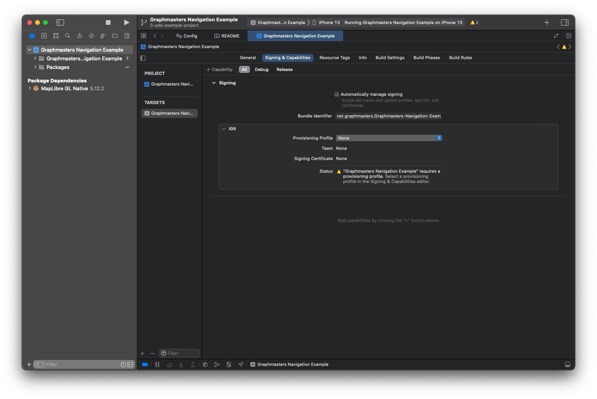

[](https://github.com/Graphmasters/graphmasters-navigation-ios/actions/workflows/ios_swift_lint.yml)
[](https://github.com/Graphmasters/graphmasters-navigation-ios/actions/workflows/ios_xcode_example_build.yml)

[](https://swift.org/package-manager/)


# Graphmasters Navigation iOS

Turn-by-turn navigation-, ui- and voice command logic

## Getting Graphmasters Navigation

### Swift Package Manager

The Swift Package Manager is the preferred way to get Graphmasters Navigation. Simply add the
package dependency to your `Package.swift`:

```swift
dependencies: [
  .package(url: "https://github.com/Graphmasters/graphmasters-navigation-ios", from: "0.0.1")
]
```

...and depend on `"GraphamstersNavigation"` and `"GraphamstersNavigationCore"` in the necessary targets:

```swift
.target(
  name: ...,
  dependencies: [
    .product(name: "GraphamstersNavigation", package: "GraphamstersNavigation"),
    .product(name: "GraphamstersNavigationCore", package: "GraphamstersNavigation")
  ]
]
```

##### Xcode

From Xcode 11 it is possible to [add Swift Package dependencies to Xcode
projects][https://help.apple.com/xcode/mac/current/#/devb83d64851] and link targets to products of those packages; this is the
easiest way to integrate *Graphmasters Navigation* with an existing `xcodeproj`.

## Graphmasters Navigation Example App

To serve as a hands on example, the example app will demonstrate the integration and usage of Graphmaster's multiplatform-navigation library via a simple iOS app.


## Getting Started

1. Add a `Config.xcconfig`-File to the project ...

```
NAVIGATION_API_KEY=your_api_token
```


... or directly in code

```
private lazy var navigationSdk: NavigationSdk = IosNavigationSdk(
    apiKey: "your_api_token"
)
```

2. For map rendering the MapLibre iOS SDK is used. You need an style to see a map. Configure it in your Config.xcconfig ...
```
MAP_STYLE_URL=your_style_url  // EXAMPLE: tiles.your-company.com (without https or "")
```
... or directly in code
```
mapView.styleURL = URL(string: "your_style_url")! 
```

3. Select your development team (optional)

If you want to test *Graphmasters Navigation Example* on a real device you have to select a development team.



## Usage
Once started the app requests permission to access the device location. After receiving a valid location, the camera will pan to that location.
Via long press on the map a destination is set and a navigation session is started.
The corresponding button will stop an active navigation. Thr Follow-button brings you back to follower-mode if you panned the map.
